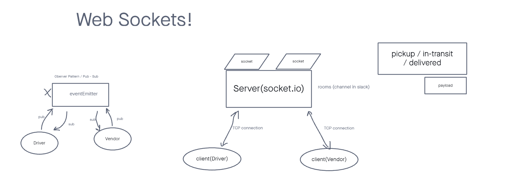

# caps-phase-2

## Collaborations
Jordan Yamada, Jeffrey Smith

## Live Deploy

## Deployment
How do I install the app or library? Clone this app and install all dependencies.

How do I test the app or library? Run "NPM test" in the terminal once all dependencies are installed.

For Applications: How do I run the app? You can run the app on your local terminal. How do I set up the app? Be sure to install all dependencies.

## Testing
Run NPM test on terminal to run the testing handlers.
Server: [node src/Global/app.js]
Driver: [node src/Driver/driverHandle.js]
Vendor: [node src/Vendor/vendorHandle.js]

## Documentation

